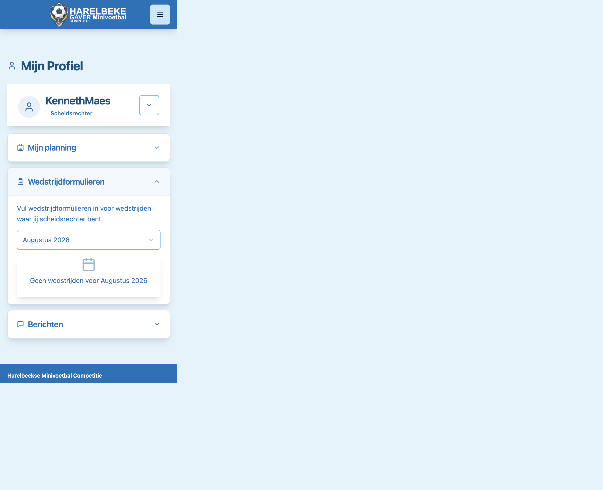
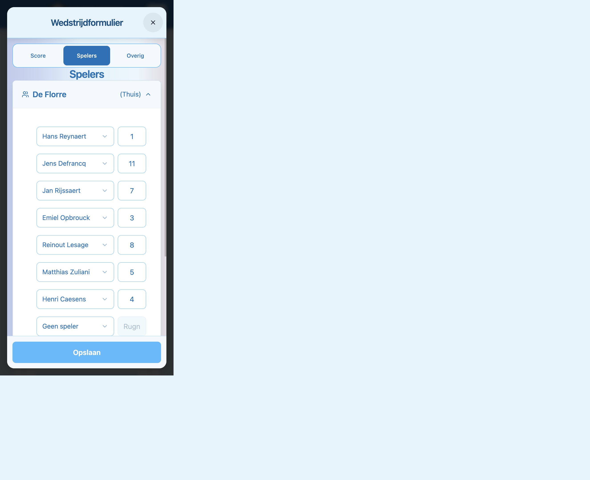
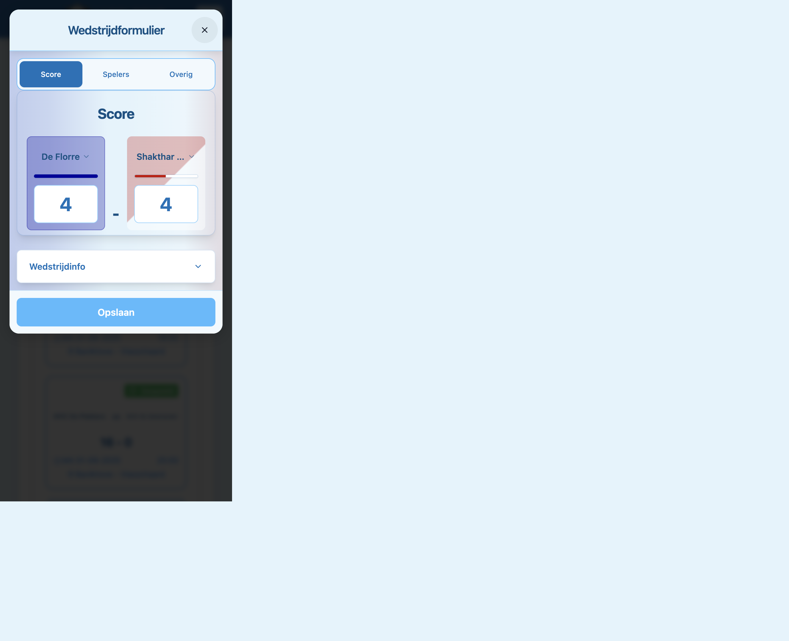
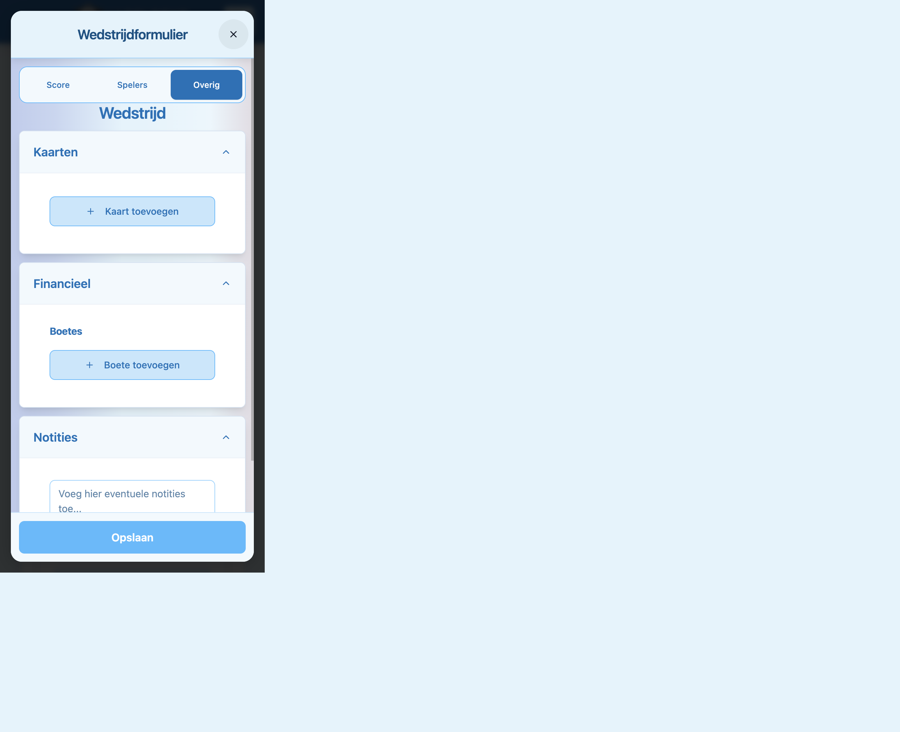

# Handleiding scheidsrechter — wedstrijdformulier

Korte gids voor scheidsrechters: formulier openen, spelers controleren vóór de wedstrijd, en score/kaarten/boetes/notities invullen na afloop.

**Word:** [HANDLEIDING_SCHEIDSRECHTER.docx](./HANDLEIDING_SCHEIDSRECHTER.docx) · **PDF:** [HANDLEIDING_SCHEIDSRECHTER.pdf](./HANDLEIDING_SCHEIDSRECHTER.pdf)

> Eerste keer inloggen? Zie [HANDLEIDING_TEAMMANAGER.md](./HANDLEIDING_TEAMMANAGER.md) stappen 1–2 (wachtwoord instellen en inloggen) — het proces is hetzelfde.

---

## 1. Inloggen

Ga naar de website van je competitie. Open het **hamburgermenu** (☰) rechtsboven en kies **Inloggen**. Vul je gebruikersnaam/e-mail en wachtwoord in.

---

## 2. Wedstrijdformulier openen

1. Open het **hamburgermenu** (☰) en klik op **Mijn profiel**.
2. Klap de sectie **Wedstrijdformulieren** open.
3. Kies de juiste **maand** in het dropdown-menu.
4. Onder **Te spelen / In te vullen** zie je wedstrijden waar jij scheidsrechter bent. Klik op de gewenste wedstrijd.

Het **Wedstrijdformulier** opent als venster op je scherm.

> **Tip:** Je ziet alleen wedstrijden die aan jou als scheidsrechter zijn toegewezen. Staat je wedstrijd er niet bij? Neem contact op met het bestuur.

---

## 3. Vóór de wedstrijd — spelers controleren

Controleer de identiteit van spelers **vóór** de aftrap (paspoort of identiteitskaart).

1. Open in het formulier de tab **Spelers**.
2. Klap **Thuis** en **Uit** open — je ziet de ingevulde spelerslijst met **naam** en **rugnummer** per ploeg.
3. Vergelijk elke speler op het veld met de namen op het formulier en met het identiteitsdocument.

**Handig:**

- Op tab **Score** kun je op de **teamnaam** tikken om contactgegevens van de teamverantwoordelijke te zien (telefoon/e-mail).
- Onder **Wedstrijdinfo** (tab Score) staan datum, tijd, locatie en speeldag.

> Spelerslijst nog leeg? Teamverantwoordelijken moeten hun spelers invullen vóór de wedstrijd (minstens 5 minuten voor aanvang). Jij kan als scheidsrechter beide ploegen aanpassen indien nodig.

---

## 4. Na de wedstrijd — score invullen

1. Ga naar tab **Score**.
2. Vul de **thuis-** en **uitscore** in.
3. Controleer de wedstrijdgegevens onder **Wedstrijdinfo** indien nodig.

---

## 5. Kaarten, boetes en notities

Ga naar tab **Overig**. Daar vind je drie secties:

### Kaarten

1. Klap **Kaarten** open.
2. Klik op **Kaart toevoegen**.
3. Kies **team**, **speler**, **type kaart** (geel/rood) en bevestig.
4. Herhaal voor elke kaart. Bestaande kaarten kan je verwijderen indien fout ingevuld.

### Boetes (Financieel)

1. Klap **Financieel** open.
2. Onder **Boetes** klik je op **Boete toevoegen**.
3. Kies het **team** en het **type boete** uit de lijst.
4. Sla de boete op.

### Notities

1. Klap **Notities** open.
2. Typ je opmerkingen in het tekstveld (incidenten, bijzonderheden, …).

---

## 6. Opslaan

Klik onderaan op **Opslaan**. Het formulier wordt verwerkt; score, kaarten en boetes komen automatisch in het systeem.

> Vul je **te laat** in (na de deadline)? Er kan automatisch een boete worden aangerekend — je ziet dan een waarschuwing bovenaan het formulier.

---

## Overzicht tabs (mobiel)

| Tab | Wanneer | Inhoud |
|-----|---------|--------|
| **Spelers** | Vóór wedstrijd | Spelerslijsten thuis/uit controleren |
| **Score** | Na wedstrijd | Uitslag + wedstrijdinfo + teamcontact |
| **Overig** | Na wedstrijd | Kaarten · Financieel (boetes) · Notities |

Op desktop staan dezelfde secties onder elkaar (geen tabs).

---

## Hulp nodig?

Neem contact op met het bestuur als:

- je wedstrijd niet in de lijst staat;
- je login niet werkt;
- het formulier op **Gesloten** staat terwijl je nog moet invullen;
- je een fout hebt gemaakt na opslaan.
