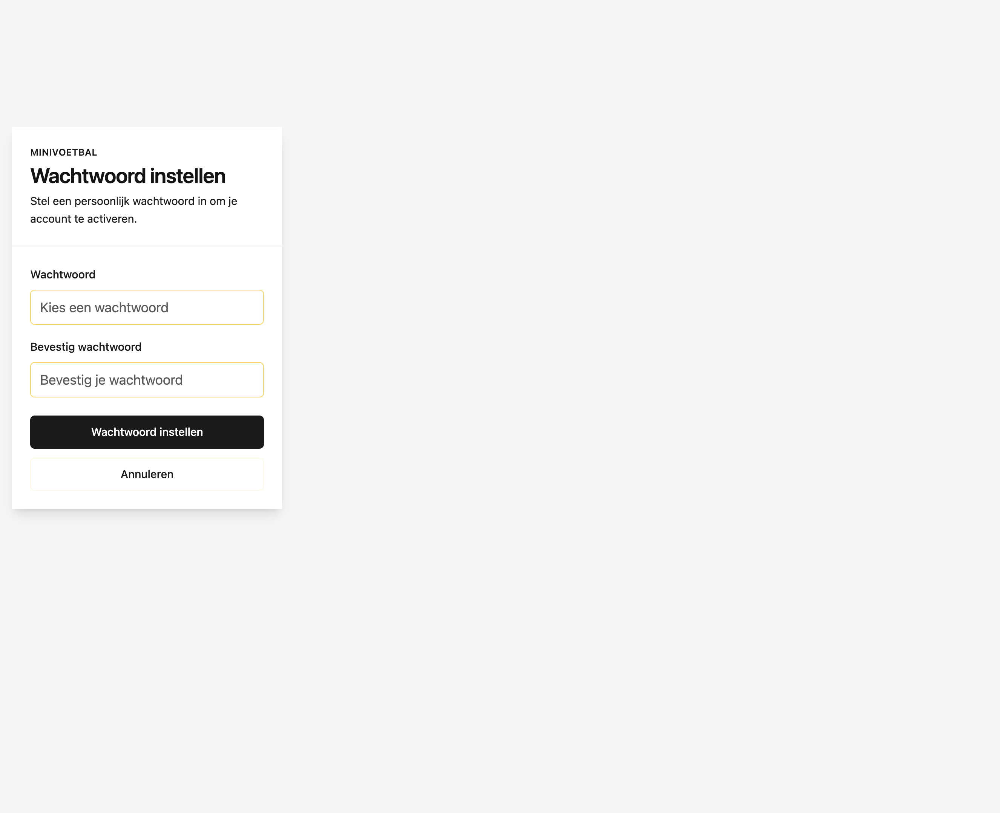
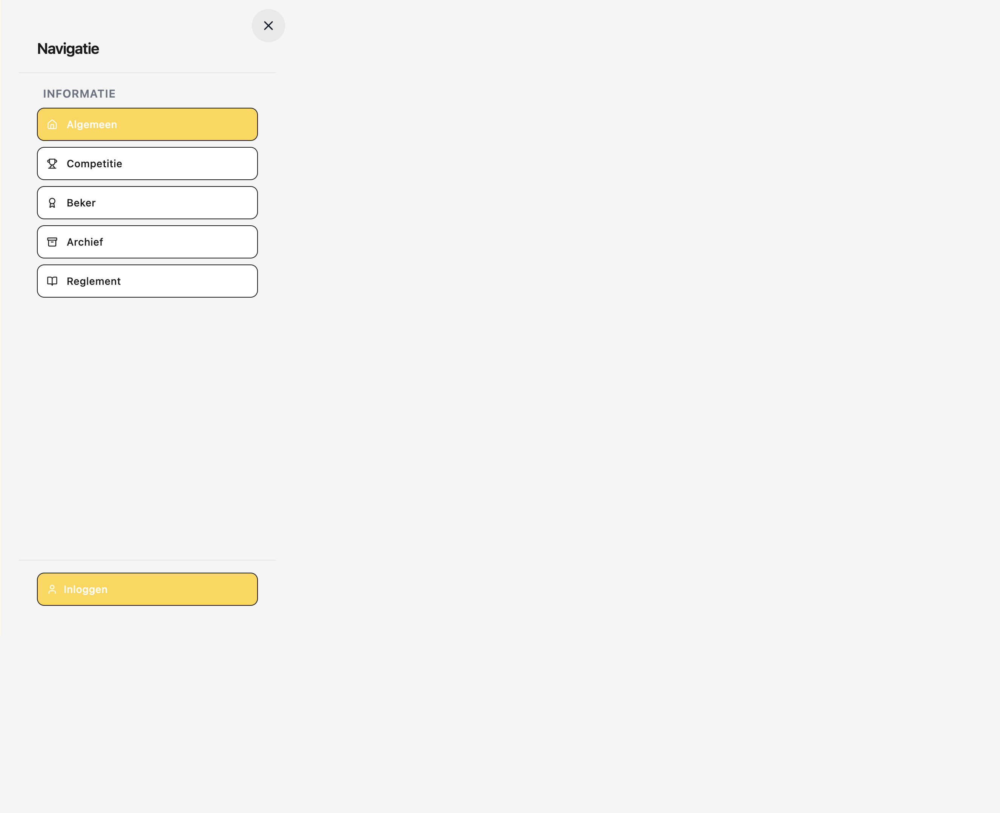
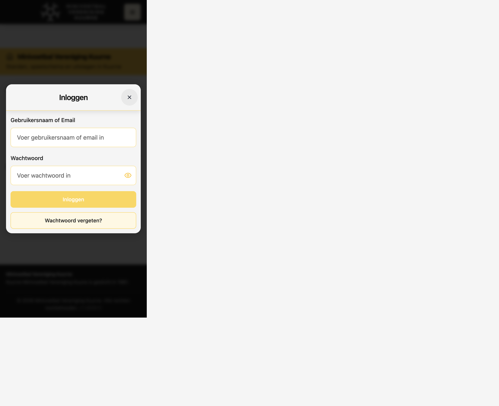
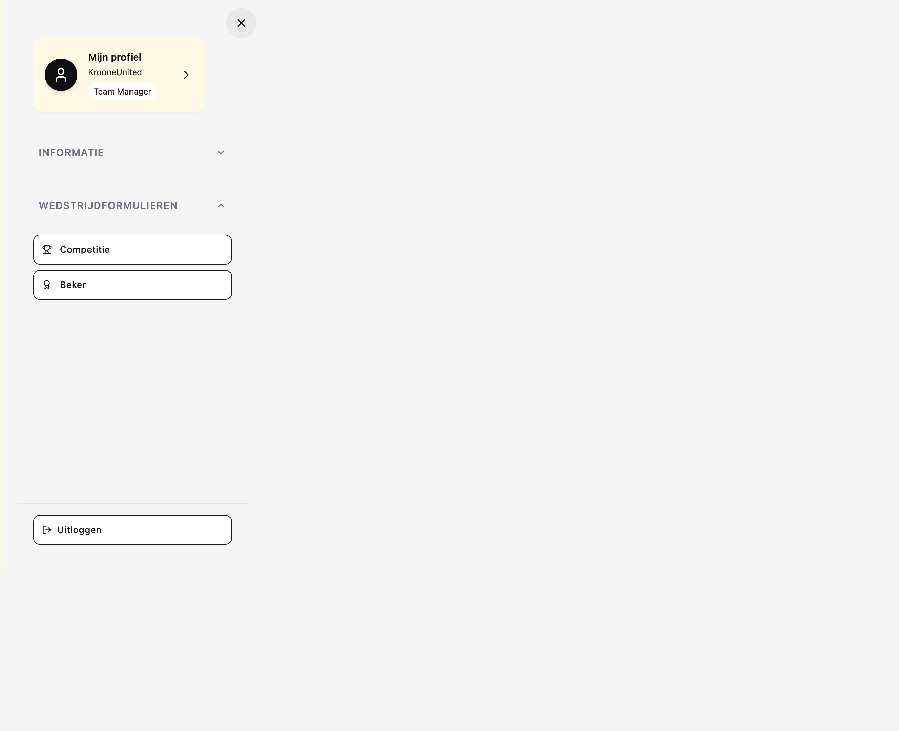
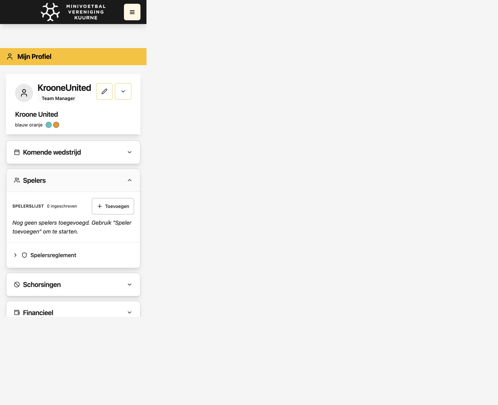
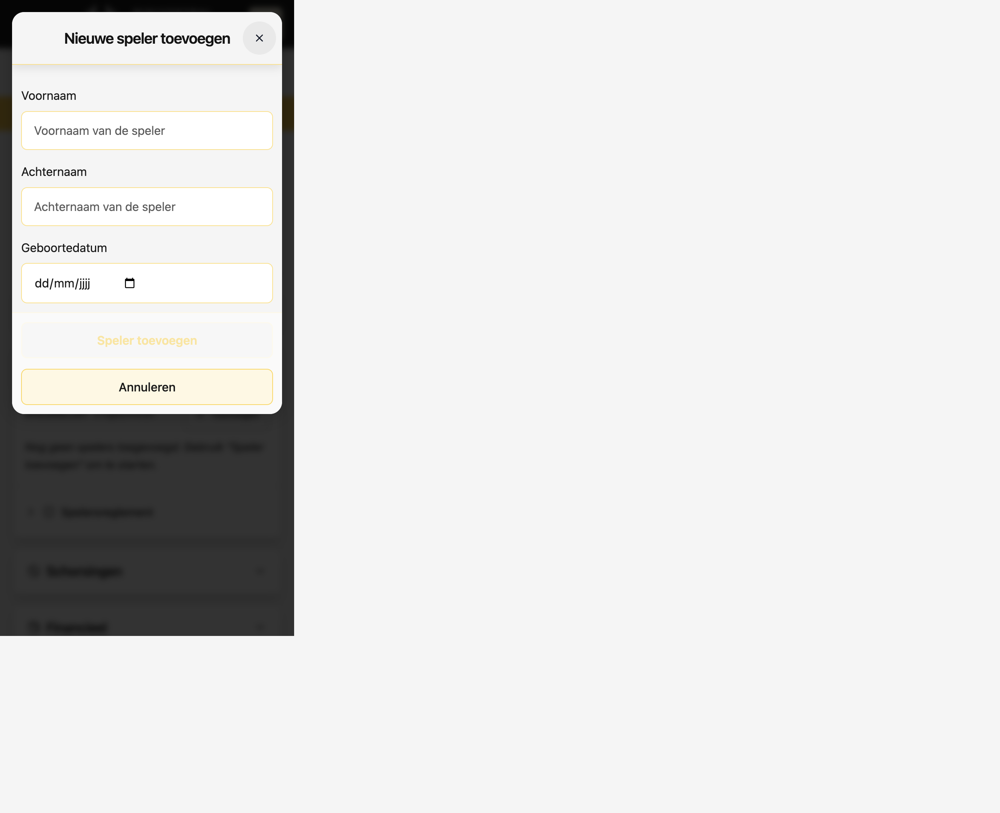

# Handleiding teamverantwoordelijke

Korte stap-voor-stap uitleg voor nieuwe gebruikers die aan een team zijn gekoppeld.

**Word:** [HANDLEIDING_TEAMMANAGER.docx](./HANDLEIDING_TEAMMANAGER.docx) · **PDF:** [HANDLEIDING_TEAMMANAGER.pdf](./HANDLEIDING_TEAMMANAGER.pdf)

---

## 1. Wachtwoord instellen (na uitnodigingsmail)

Je ontvangt een e-mail met een link om je account te activeren. Klik op de link in de mail.

Op het scherm **Wachtwoord instellen** kies je een wachtwoord (twee keer hetzelfde) en klik je op **Wachtwoord instellen**.

> **Tip:** Gebruik minstens 8 tekens. Bewaar je wachtwoord op een veilige plek.

---

## 2. Inloggen

Ga naar de website van je competitie. Rechtsboven staat het **hamburgermenu** (☰). Klik daarop en kies **Inloggen** onderaan het menu.

Vul je **gebruikersnaam of e-mailadres** en je **wachtwoord** in. Klik op **Inloggen**.

---

## 3. Hamburger menu openen

Na het inloggen zie je rechtsboven opnieuw het **hamburgermenu** (☰). Klik hierop.

---

## 4. Mijn profiel

In het menu staat bovenaan je profielkaart met **Mijn profiel** en de naam van je team. Klik hierop.

Je komt op de pagina **Mijn Profiel** met teamgegevens en verschillende secties.

---

## 5. Spelers

Op je profielpagina zie je meerdere secties (accordion). Klik op **Spelers** om deze uit te klappen.

---

## 6. Speler toevoegen

In de sectie Spelers klik je op **+ Toevoegen** (rechtsboven in de spelerslijst).

Er opent een venster **Nieuwe speler toevoegen**.

---

## 7. Gegevens invullen en opslaan

Vul in:

- **Voornaam**
- **Achternaam**
- **Geboortedatum** (klik op het kalender-icoon of typ `dd/mm/jjjj`)

Controleer de gegevens en klik op **Speler toevoegen**. De speler verschijnt daarna in je spelerslijst.

---

## Hulp nodig?

Neem contact op met het bestuur van je competitie als:

- je geen uitnodigingsmail ontvangt (controleer ook je spam-map);
- de link verlopen is;
- je je wachtwoord bent vergeten (gebruik **Wachtwoord vergeten?** op het inlogscherm).
