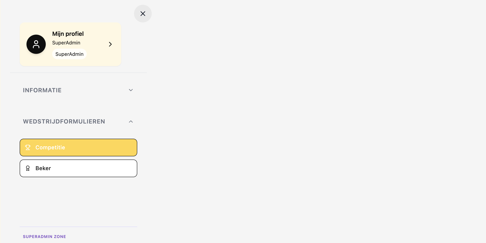
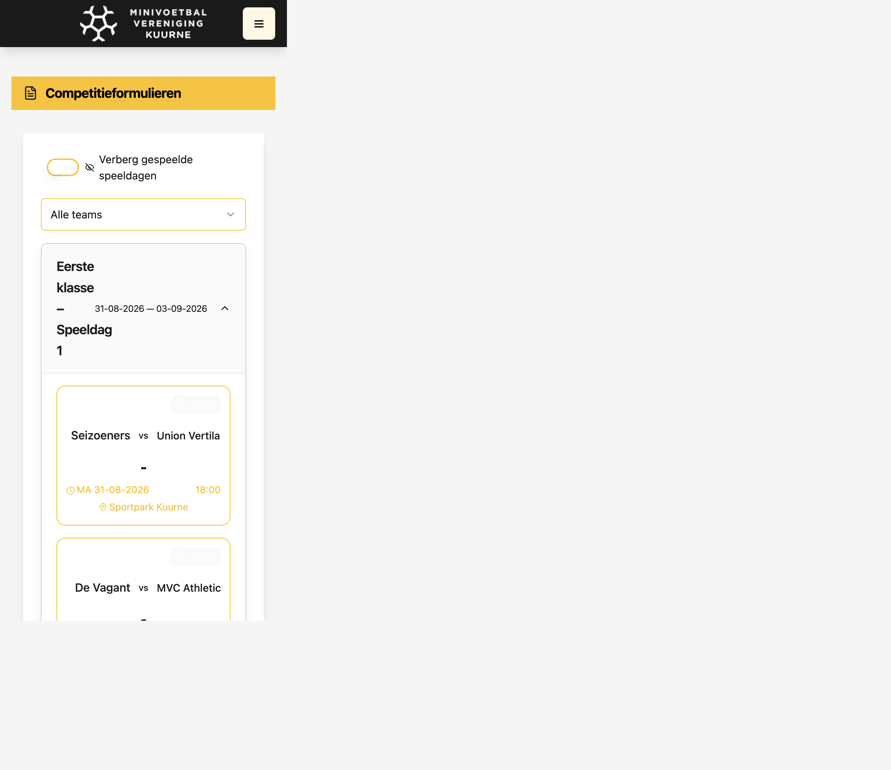
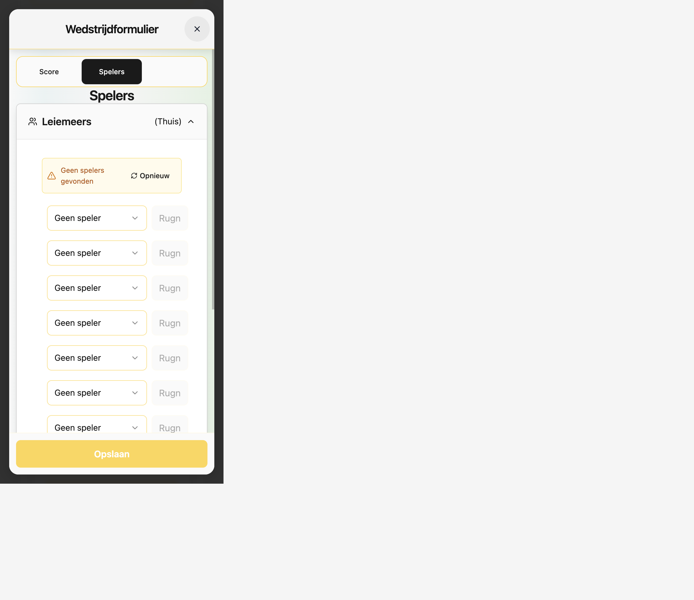
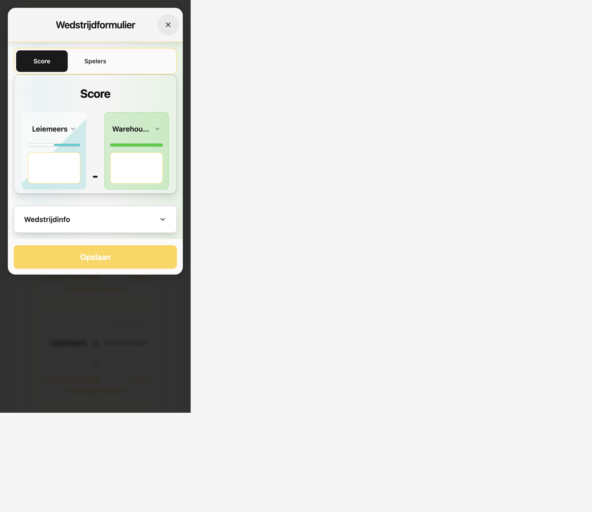

# Handleiding teamverantwoordelijke — wedstrijdformulier

Korte gids voor teamverantwoordelijken van **Minivoetbal Vereniging Kuurne**: wedstrijdformulier openen en je spelers invullen vóór de wedstrijd.

**Site:** [www.mvvkuurne.be](https://www.mvvkuurne.be)  
**Word:** [HANDLEIDING_TEAMMANAGER_WEDSTRIJD.docx](./HANDLEIDING_TEAMMANAGER_WEDSTRIJD.docx) · **PDF:** [HANDLEIDING_TEAMMANAGER_WEDSTRIJD.pdf](./HANDLEIDING_TEAMMANAGER_WEDSTRIJD.pdf)

> Eerste keer inloggen of spelers toevoegen aan je team? Zie [HANDLEIDING_TEAMMANAGER.md](./HANDLEIDING_TEAMMANAGER.md).

---

## 1. Inloggen

Ga naar [www.mvvkuurne.be](https://www.mvvkuurne.be). Open het **hamburgermenu** (☰) rechtsboven en kies **Inloggen**. Vul je gebruikersnaam/e-mail en wachtwoord in.

---

## 2. Wedstrijdformulier openen

Je hebt **twee manieren** om het formulier te openen:

### Optie A — via Mijn profiel (snelste)

1. Open het **hamburgermenu** (☰) en klik op **Mijn profiel**.
2. Klap de sectie **Komende wedstrijd** open.
3. Klik op je wedstrijd in de lijst.

> Staat er *Geen komende wedstrijden gepland*? Gebruik optie B of neem contact op met het bestuur.

### Optie B — via Wedstrijdformulieren

1. Open het **hamburgermenu** (☰).
2. Klap **Wedstrijdformulieren** open.
3. Kies **Competitie** of **Beker** (afhankelijk van het type wedstrijd).

4. Zoek je **speeldag** en klik op **Open** bij de wedstrijd van jouw team.

Het **Wedstrijdformulier** opent als venster op je scherm.

---

## 3. Spelers invullen (vóór de wedstrijd)

Bied het wedstrijdblad **minstens 10 minuten** voor aanvang aan (algemeen reglement MVV Kuurne, art. 32).

1. Open tab **Spelers** (standaard actief bij openen).
2. Klap **jouw team** open — dat is de ploeg waarvoor jij verantwoordelijk bent (Thuis of Uit). De tegenstander kan je wel bekijken, maar **niet** aanpassen.
3. Per rij:
   - Kies de **speler** uit het dropdown-menu.
   - Vul het **rugnummer** in.
4. Kies onderaan je ploeg de **aanvoerder** in het dropdown-menu **Aanvoerder**.

**Handig:**

- Speler staat niet in de lijst, of je ziet *Geen spelers gevonden*? Voeg hem eerst toe via **Mijn profiel → Spelers** (zie [handleiding spelers](./HANDLEIDING_TEAMMANAGER.md#6-speler-toevoegen)).
- Geschorste spelers worden in het formulier gemarkeerd — neem ze niet op in je opstelling.

---

## 4. Score bekijken

Ga naar tab **Score**. Daar zie je de uitslag zodra de scheidsrechter die heeft ingevuld.

> **Jij vult de score niet in.** Onder de score staat: *Score wordt ingevuld door de scheidsrechter.* Kaarten, boetes en notities zijn ook niet zichtbaar voor teamverantwoordelijken — dat doet de scheidsrechter.

Op tab **Score** kun je **Wedstrijdinfo** openklappen voor datum, tijd, locatie en speeldag.

---

## 5. Opslaan

Klik onderaan op **Opslaan**. Je spelerslijst wordt opgeslagen en is zichtbaar voor de scheidsrechter.

> Vul je **te laat** in (na de deadline)? Er kan automatisch een boete worden aangerekend volgens de boetelijst — je ziet dan een waarschuwing bovenaan het formulier.

---

## Overzicht tabs (mobiel)

| Tab | Wanneer | Wat jij doet |
|-----|---------|--------------|
| **Spelers** | Vóór wedstrijd | Eigen ploeg + aanvoerder invullen |
| **Score** | Na wedstrijd | Uitslag en wedstrijdinfo bekijken |

Op desktop staan dezelfde secties onder elkaar (geen tabs).

---

## Hulp nodig?

Neem contact op met het bestuur als:

- je wedstrijd niet in de lijst staat;
- je login niet werkt;
- het formulier op **Gesloten** staat terwijl je nog moet invullen;
- een speler ontbreekt in het dropdown-menu (controleer eerst je spelerslijst op je profiel).
